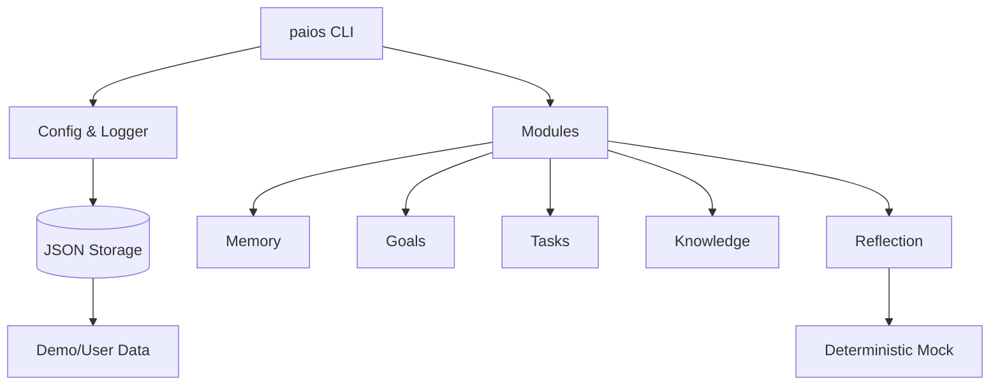

# Personal AI OS
Offline-first CLI to manage notes, goals, tasks, reflections, and knowledge in minutes.


## What it does
Personal AI OS is a lightweight, local-first “AI OS” that keeps your notes, goals, tasks, reflections, and knowledge base in simple JSON storage. It ships with a deterministic mock LLM so everything works offline out of the box.

## Who it’s for
- Founders who need fast goal→task planning without cloud dependencies.
- Researchers who want searchable notes/knowledge offline.
- Productivity nerds tracking daily reflections and weekly plans.
- Engineers who prefer a transparent, testable CLI with JSON state.

## Features
- `paios add-note` to capture notes with tags and instant search.
- `paios set-goal` + `plan-week` to turn goals into a weekly task plan.
- `paios daily-reflect` to generate deterministic daily recaps via mock LLM.
- Knowledge base: `knowledge-add` / `knowledge-search` for Q&A storage.
- JSON storage under `data/` (override with `PAIOS_DATA_DIR`), works fully offline.
- `make setup/lint/test/demo/doctor` for 2–5 minute time-to-wow and health checks.
- CI (GitHub Actions) runs lint + tests on every push/PR.
- Pre-commit, ruff, black ensure consistent style; tests cover CLI and modules.

## Quickstart
```bash
git clone https://github.com/Exmanq/personal-ai-os.git
cd personal-ai-os
make setup          # venv + deps
make demo           # creates examples/output/* with real results
source .venv/bin/activate
paios add-note "First note" --tags idea
paios set-goal "Ship something" --deadline 2026-03-01
paios plan-week
paios daily-reflect
```

## Example output / screenshots
`make demo` writes tangible artifacts:

- `examples/output/plan.json`
```json
[
  {"title": "Progress for goal: Ship Personal AI OS demo", "due": "2026-02-08", "status": "planned"},
  {"title": "Progress for goal: Establish daily reflection habit", "due": "2026-02-09", "status": "planned"},
  {"title": "Progress for goal: Demo goal: deliver wow", "due": "2026-02-10", "status": "planned"},
  {"title": "Progress for goal: Demo goal: deliver wow", "due": "2026-02-11", "status": "planned"}
]
```
- `examples/output/reflection.json`
```json
{
  "date": "2026-02-08",
  "summary": "Daily recap: Drafted personal AI OS scaffold and CLI; Planned weekly goals for focus and health; Demo note: shipped CLI; Demo note: shipped CLI. Action: pick one task to advance a goal.",
  "note_count": 4
}
```

## How it works

- Typer CLI exposes commands for notes, goals, planning, reflections, knowledge.
- Core config reads env/flags; logging is quiet by default, verbose when needed.
- Storage writes JSON via pathlib for cross-platform safety.
- Reflection uses a deterministic mock LLM so no API keys are required.
- `make demo` exercises the full flow and saves outputs.
- See more in [docs/ARCHITECTURE.md](docs/ARCHITECTURE.md).

## Configuration
- Env vars: `PAIOS_DATA_DIR` (default `data/demo`), `PAIOS_VERBOSE` (false/true).
- CLI flags: `--data-dir PATH` per command to isolate datasets; `--verbose` for debug logs.
- Files: JSON state under `data/`; outputs under `examples/output/`; `.env.example` for defaults.
- Docs: [docs/CONFIG.md](docs/CONFIG.md).

## Troubleshooting
- **Command not found**: activate venv (`source .venv/bin/activate`) after `make setup`.
- **Permission issues writing data**: point to a writable folder via `--data-dir` or `PAIOS_DATA_DIR`.
- **Windows paths**: use forward slashes or quotes, pathlib handles the rest.
- **Need a quick health check**: run `make doctor` or `paios doctor` to see env and data dir.

## Contributing
See [CONTRIBUTING.md](CONTRIBUTING.md) for setup, lint/test commands, and PR guidelines.

## Security
Secrets are never stored in the repo. Keep future API keys in environment variables (see [SECURITY.md](SECURITY.md)); logs avoid printing sensitive data.

## License
MIT — see [LICENSE](LICENSE).
