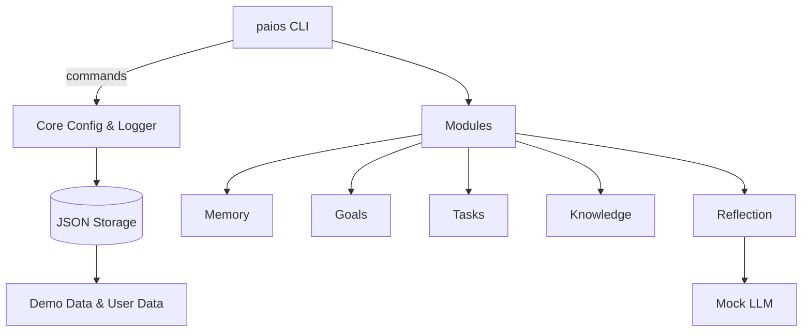

# Architecture

- CLI uses Typer commands (`add-note`, `set-goal`, `plan-week`, `daily-reflect`, `knowledge-*`, `doctor`).
- Core manages configuration (`PAIOS_DATA_DIR`, `PAIOS_VERBOSE`) and shared logging/console.
- Storage is JSON-file based, using pathlib for cross-platform paths.
- Modules encapsulate domains: memory, goals, tasks, knowledge, reflection; reflection pipes notes through a deterministic mock LLM.
- Data lives under `data/demo` by default; override with `PAIOS_DATA_DIR` for real usage.
- CI mirrors Make targets; `make demo` writes tangible outputs to `examples/output`.
