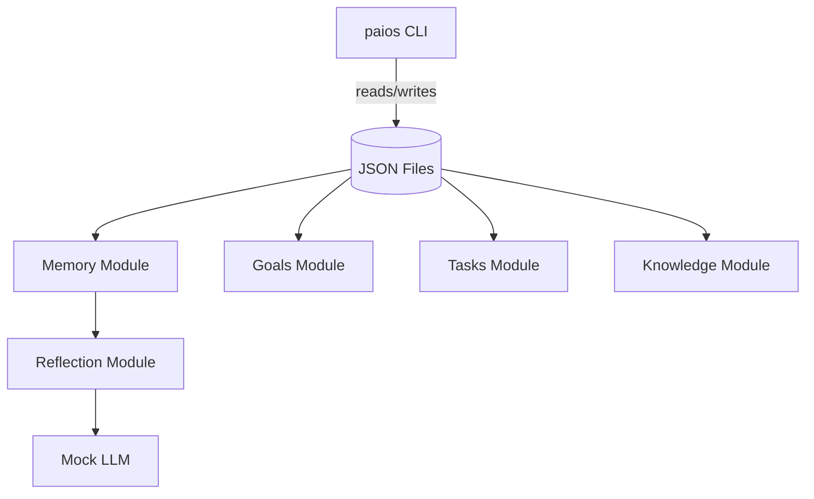

# Architecture

- **CLI** exposes commands for notes, goals, planning, reflection, and knowledge search.
- **Storage** is a light JSON layer writing to `data/` (overridable via `PAIOS_DATA_DIR`).
- **Modules** implement domain logic: memory, goals, tasks, knowledge, and reflection.
- **Mock LLM** produces deterministic summaries so the project works offline.
- **Docs & Examples** show flows; `make demo` writes outputs to `examples/output`.
- **CI** enforces lint + tests; Makefile guarantees setup/lint/test/demo/doctor in one step.
